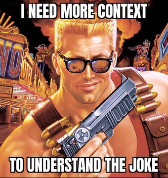
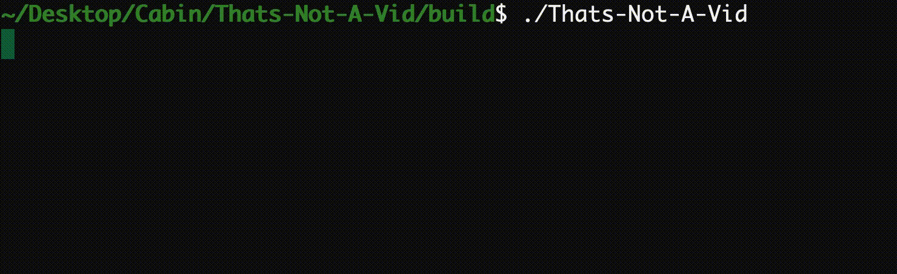

## Infinite-Storage-Glitch Knockoff, written in C++.

**That's not a vid, this is a vid.**


### Convert your files to videos, upload them to streaming services to get unlimited disk storage!


#### *Transform this*:



#### *To this:*


#### Using intuitive CLI:




### Running:

1. Clone this repository 

```bash
git clone https://github.com/Sberm/Thats-Not-A-Vid.git
```

2. Build the project

```bash
mkdir build
cd build
cmake ..
cmake --build .
./Thats-Not-A-Vid
```

3. enjoy!!
