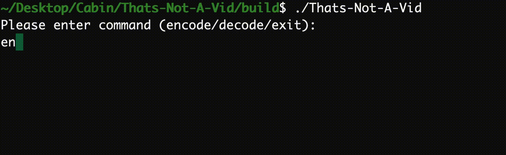

## Thats-Not-A-Vid

Infinite-Storage-Glitch knockoff, written in C++.

**That's not a vid, this is a vid.**

### Convert your files to videos, upload them to streaming services to get unlimited disk storage!

#### *Convert this*:


#### *Into this:*


#### Using intuitive CLI:

encoding



decoding


### Running:

1. Clone this repository 

```bash
git clone https://github.com/Sberm/Thats-Not-A-Vid.git
```

2. Install opencv library

2. Build the project, and run

```bash
# install opencv and cmake
# on Ubuntu
sudo apt install libopencv-dev cmake

# compile
mkdir build
cd build
cmake ..
cmake --build .
./Thats-Not-A-Vid
```
